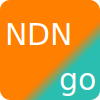

# NDNgo: Named Data Networking in Go

**NDNgo** is a minimal [Named Data Networking](https://named-data.net/) library compatible with the NDN-DPDK forwarder.
This library does not depend on Cgo, and can be used in external projects via Go Modules.
However, NDNgo has no API stability guarantees: breaking changes may happen at any time.

## Features

Packet encoding and decoding

* General purpose TLV codec (in [package tlv](tlv))
* Interest and Data: [v0.3](https://named-data.net/doc/NDN-packet-spec/0.3/) format only
  * TLV evolvability: yes
  * Signed Interest: basic support
* [NDNLPv2](https://redmine.named-data.net/projects/nfd/wiki/NDNLPv2)
  * Fragmentation and reassembly: no
  * Nack: yes
  * PIT token: yes
  * Congestion mark: yes
  * Link layer reliability: no
* Naming Convention: no

Transports

* Unix stream, UDP unicast, TCP (in [package sockettransport](sockettransport))
* Ethernet via [GoPacket library](https://github.com/google/gopacket) (in [package packettransport](packettransport))
* Shared memory with local NDN-DPDK forwarder via [memif](https://pkg.go.dev/github.com/FDio/vpp/extras/gomemif/memif?tab=doc) (in [package memiftransport](memiftransport))

KeyChain

* Encryption: no
* Signing algorithms
  * SHA256: yes
  * ECDSA: no
  * RSA: yes (in [package rsakey](keychain/rsakey))
  * HMAC-SHA256: no
  * [Null](https://redmine.named-data.net/projects/ndn-tlv/wiki/NullSignature): yes
* [NDN certificates](https://named-data.net/doc/ndn-cxx/0.7.0/specs/certificate-format.html): no
* Key persistence: no
* Trust schema: no

## Getting Started

At the moment, this library lacks an application layer *Face* or *Endpoint* abstraction.
The best place to get started is [package l3](l3) `l3.Face` type, which provides a network layer face abstraction.
An example is in [command ndndpdk-packetdemo](../cmd/ndndpdk-packetdemo).
